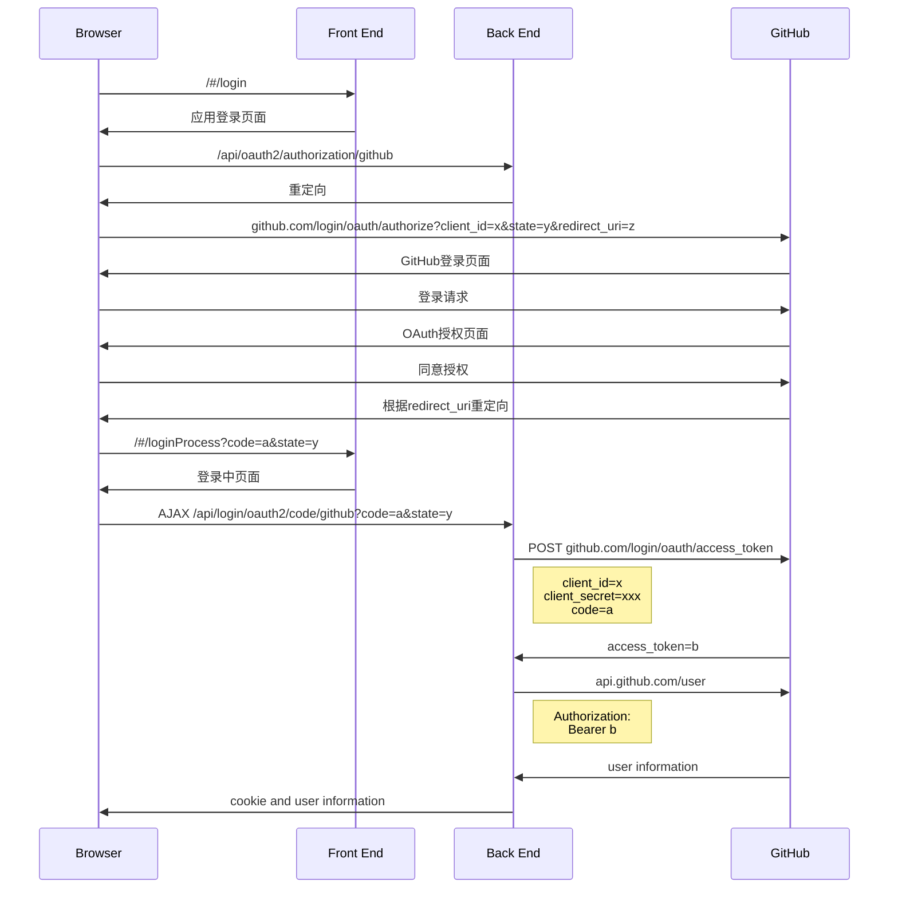

## 登录时序图

<!--more-->




## 后端关键代码

`pom.xml`引入Sprint Boot OAuth Client

```xml
<dependency>
    <groupId>org.springframework.boot</groupId>
    <artifactId>spring-boot-starter-oauth2-client</artifactId>
</dependency>
```

`application.yml`

```yml
spring:
  security:
    oauth2:
      client:
        registration:
          github:
            clientId: c2d09789aad2
            clientSecret: b300def96a469a08a5774dfb5f9d64
            redirect-uri: http://localhost:8081/#/loginProcess
```

`SecurityConfiguration.java`

```java
@Slf4j
@Configuration
public class SecurityConfiguration {
    @Bean
    public SecurityFilterChain filterChain(HttpSecurity http) throws Exception {
        http.authorizeRequests((requests) -> requests.antMatchers("/loginProcess", "/redirect").permitAll().anyRequest().authenticated())
            .oauth2Login()
            .successHandler((request, response, authentication) -> {
                response.setContentType("application/json;charset=utf-8");
                response.setStatus(HttpServletResponse.SC_OK);
                PrintWriter printWriter = response.getWriter();
                String s = JSONObject.toJSONString(authentication.getPrincipal());
                printWriter.write(s);
                printWriter.flush();
                printWriter.close();
            })
            .failureHandler(((request, response, exception) -> {
                response.setContentType("application/json;charset=utf-8");
                response.setStatus(HttpServletResponse.SC_INTERNAL_SERVER_ERROR);
                PrintWriter printWriter = response.getWriter();
                printWriter.write(exception.getMessage());
                printWriter.flush();
                printWriter.close();
            }))
            .and().exceptionHandling().authenticationEntryPoint((request, response, authException) -> {
                response.setContentType("application/json;charset=utf-8");
                response.setStatus(HttpServletResponse.SC_UNAUTHORIZED);
                PrintWriter printWriter = response.getWriter();
                printWriter.write(authException.getMessage());
                printWriter.flush();
                printWriter.close();
            });

        return http.build();
    }
}
```


## 前端关键代码

`LoginProcessPage.vue`

```vue
<template>
  <h3>Wait a second...</h3>
</template>

<script>
import utils from '@/utils/language-trainer'
export default {
  name: "LoginProcessPage",
  methods: {
    handleLogin() {
      const url = window.location.href
      const code = utils.getUrlQueryParameter(url, 'code')
      const state = utils.getUrlQueryParameter(url, 'state')

      this.axios.get('api/login/oauth2/code/github?code=' + code + '&state=' + state, {
        timeout: 5000,
      }).then(response => {
        window.sessionStorage.setItem('nickname', response.data.attributes.name)
        this.$router.push('/')
        this.$message({
          message: 'Login with GitHub successfully.',
          type: 'success'
        })
      }).catch(() => {
        this.$router.push('/login')
        this.$message({
          message: 'Fail to login with GitHub.',
          type: 'error'
        })
      })
    }
  },
  created() {
    this.handleLogin()
  }
}
</script>

<style scoped>

</style>
```

