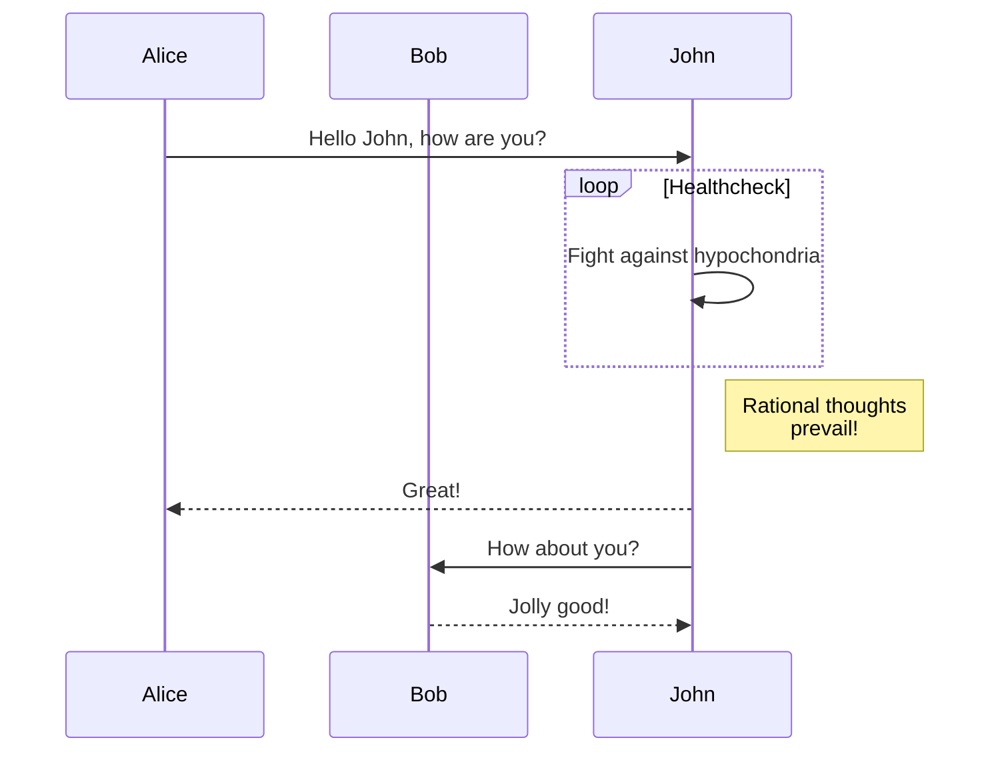

# 这里是一些测试
## Here's some test!

### Short paragraph
Here's some test.

### Long paragraph
奥斯陆（挪威语：Oslo[ˈʊ̂ʂlʊ]），1925年前旧称克里斯蒂安尼亚（Kristiania），是挪威首都和最大城市，全国政治、经济、文化中心，也是挪威的贸易、银行业、工业和航运枢纽，位于挪威东南部的奥斯陆峡湾内侧，人口666, 759人（截至2017年1月1日）。包括邻近的10个市镇在内的城市区人口为975, 744人（截至2016年1月1日），而整个大奥斯陆地区人口数为1, 546, 706。

<!--more-->

奥斯陆因其奇特的地理学和地质学特征而闻名。它被森林和田野所环绕，许多种类的动植物生活在其中。奥斯陆市镇内三分之二的面积是森林和水域，使得实际人口密度达到了5, 221.6人/平方公里。城市核心区的形状像是一个被植被茂密的丘陵所环绕的砂锅，许多河流从丘陵中流出，通过市区汇入奥斯陆峡湾。

### Long paragraph #2
Oslo (/ˈɒzloʊ/ OZ-loh, also US: /ˈɒsloʊ/ OSS-loh, locally [ˈʊ̂ʂlʊ] (About this soundlisten), rarely [ˈʊ̂slʊ, ˈʊ̀ʂlʊ]) is the capital and most populous city of Norway. It constitutes both a county and a municipality. During the Viking Age the area was part of Viken, the northernmost Danish province. Oslo was founded as a city at the end of the Viking Age in the year 1040 under the name Ánslo, and established as a kaupstad or trading place in 1048 by Harald Hardrada. The city was elevated to a bishopric in 1070 and a capital under Haakon V of Norway around 1300. Personal unions with Denmark from 1397 to 1523 and again from 1536 to 1814 reduced its influence. After being destroyed by a fire in 1624, during the reign of King Christian IV, a new city was built closer to Akershus Fortress and named Christiania in the king's honour. It was established as a municipality (formannskapsdistrikt) on 1 January 1838. The city functioned as the capital of Norway during the 1814–1905 union between Sweden and Norway. From 1877, the city's name was spelled Kristiania in government usage, a spelling that was adopted by the municipal authorities only in 1897. In 1925 the city, after incorporating the village retaining its former name, was renamed Oslo. In 1948 Oslo merged with Aker, a municipality which surrounded the capital and which was 27 times larger, thus creating the modern, vastly enlarged Oslo municipality.

## Here's another test!

### Code block

```java
public class Test {
    public static void main(String[] args) {
        System.out.println("Yes, run some tests");
    }
}
```

```javascript
function sayHello() {
    console.log('Hello!');
}
```
### Code Line

`printf(%s, string);`

## Third test

### Emoji

:koala::confused::+1:

### Font
*Italic* **Bold** ***Italic and Bold***

### 分隔线
---

### 删除线
~~deleted content~~

### Continue to test

* 1
* 2
* 3

1. First
2. Second
3. Third

>references to .....

[Click Here to Home Page](http://blog.oliverclio.com)


|Id|name|
|- | -  |
|1 |Tom|
|2 |Mary|

Success Text
{:.success}

Info Text.
{:.info}

Warning Text.
{:.warning}

Error Text.
{:.error}

`success`{:.success} `info`{:.info} `warning`{:.warning} `error`{:.error}

When $$a \ne 0$$, there are two solutions to $$ax^2 + bx + c = 0$$ and they are

$$x_1 = {-b + \sqrt{b^2-4ac} \over 2a}$$

$$x_2 = {-b - \sqrt{b^2-4ac} \over 2a}$$




```chart
{
  "type": "polarArea",
  "data": {
    "datasets": [
      {
        "data": [
          11,
          16,
          7,
          3,
          14
        ],
        "backgroundColor": [
          "#FF6384",
          "#4BC0C0",
          "#FFCE56",
          "#E7E9ED",
          "#36A2EB"
        ],
        "label": "My dataset"
      }
    ],
    "labels": [
      "Red",
      "Green",
      "Yellow",
      "Grey",
      "Blue"
    ]
  },
  "options": {}
}
```